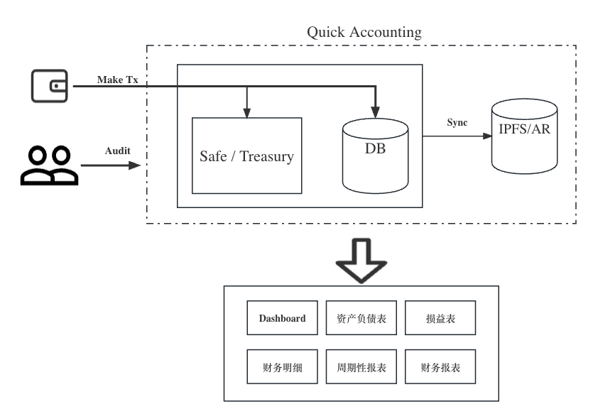

# Quick-Accounting

Quick Accounting (QA) is an web3 accounting software for crypto organizations. QA has the ability to tracking the transactions of crypto assets for organizations, maintain balance sheet of organizations, and generate financial reports. Everything in QA is trackable, and transparent.

# Overview

